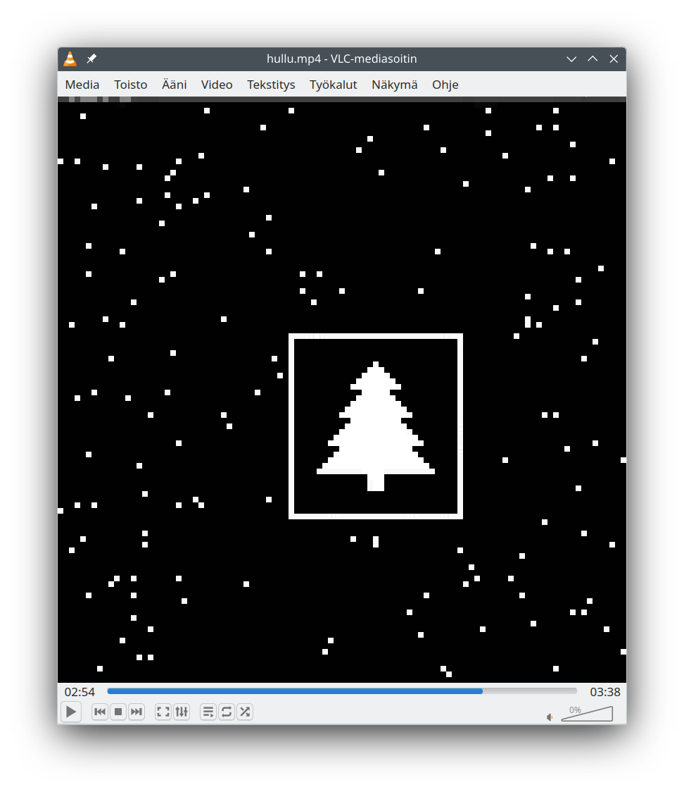

# Logbook 2024

## Other sites worth reading

Keep on reading, but I just want to say that I have used the following
sites as a therapy after finishing my daily puzzles:

* [Saaste's AoC blog](https://saaste.net/muuta/ohjelmointi/advent-of-code-2024/) (in Finnish)
* [Reddit AoC](https://old.reddit.com/r/adventofcode/) solution megathreads

## Day 1, Sunday

Assignment: [Historian Hysteria](https://adventofcode.com/2024/day/1)

Started in the evening. Started using Haskell because I had been using
Haskell in a company project in last few weeks and had the libraries
in fresh memory.

I noticed it would've been possible to do it with LibreOffice
spreadsheet, but decided to write a decent parser since I started late
and being quick wasn't important and it was Sunday so had free time.

Joined to the private leaderboard of my former student club.

Very easy, did both stars it in less than 30 min from scratch while
wandering in Hackage library docs.

View my code: [Day01.hs](src/Day01.hs)

## Day 2, Monday

Assignment: [Red-Nosed Reports](https://adventofcode.com/2024/day/2)

A little bit dull CS1 grade assignment. First part could've be done in a
spreadsheet but the second probably not since it required branching.

Well, maybe it could've been done without loops with clever conditions
and state passing but I didn't want it to become too complex and
unreadable mess. In Haskell I have a garbage collector and I'm not afraid
to use it.

I was so bored after this that I made proper command line parser and
small framework to help solving the assignments in upcoming days.

I'm so tired about the culture war around master/main terminology so I
decided to rename my AoC repository default branch as *pukki* after
*joulupukki*, the Finnish word for Santa Claus.

View my code: [Day02.hs](src/Day02.hs)

## Day 3, Tuesday

Assignment: [Mull It Over](https://adventofcode.com/2024/day/3)

I really didn't do the full parser initially. I hacked a very quick
and dirty parser first and I wrote a proper parser in Part 2. I reused
the more complete parser from Part 2 and processed the output with
input that has been pre-filtered to remove *Don't* statements.

I liked the assignment because it was no longer a spreadsheet
task. Finally got the possibility to benefit from a proper
backtracking parser library.

Maybe 30 min solution again. I was quicker than expected because I
already had the bells and whistles at hand.

View my code: [Day03.hs](src/Day03.hs)

## Day 4, Wednesday

Assignment: [Ceres Search](https://adventofcode.com/2024/day/4)

Not my day, not the right tools.

Started over 4 times after getting super desperate about how to
process this in a functional language.

Noticed that Text index function is O(n) rather than O(1) so decided
to fix the "framework" to use ByteStrigs instead of Text. This
should've been the first thought and not an afterthought since AoC
never uses weird UTF-8 input. Let's see if tomorrow there will be 🎅
in the input and I'll start spinning again.

There was nothing to parse so the solution was to just extract bounds
from the input and write the index to coordinate conversion functions
so that they manage with the newlines.

The correct language in this case would have been plain old C. Very
straightforward character comparison and stuff. I just didn't want to
give up. I was **that** close to make it in C with FFI interface.

After getting my shit together after hours of running around aimlessly
I had one incorrect answer because I forgot top right to bottom left
and bottom left to top right diagonals. After adding them, I got a
correct answer.

The second part required new approach but I was able to reuse the
coordinate conversions. This time I got everything correct on first
try but getting there lead me to matrix algebra and stuff like that
which I decided not to use.

I would've sacked the guy who was hopelessly pressing buttons in
front of a computer. Definitely not a professional. That guy was me.

PS. Obfuscated variable and type names for your extra amusement.

View my code: [Day04.hs](src/Day04.hs)

## Day 5, Thursday

Assignment: [Print Queue](https://adventofcode.com/2024/day/5)

Okay, this time it was a Haskell day. Even though I could've been fast,
it was morning and didn't manage to speedcode. It took something like
1h 13min to complete the Part 1 and about two minutes to complete the
second, both without retrys.

Initially, I read the instructions incorrectly and thought what would
come in Part 2 would've been the first part. No bad feelings though,
since I managed to do Part 2 extraordinarily quick, just changing `==`
to `/=`.

I was happy that I had my CS degree, immediately noticed that this is
a case for a user-supplied comparator. So I did it and we can enjoy a
nice and smooth *O(n log n)* complexity in computation. Well, in AoC,
the assignments are simple enough to brute-force anyway. But it gives
a warm fuzzy feeling, like a glass of warm mulled wine. 🍵

Afterwards, while cleaning up code, I noticed I had a bug in the
comparator, where I did compare `a < b` correctly but not `a > b` because
of quick copypasting around. Well, it didn't hit, but a fixed version is
now in the repo.

PS. In case you've wondered why there are JSON instances in my code
even though I'm not processing JSON. It's for the command line switch
`-j` which dumps the parsed output to JSON which is quick to process
with `jq` if I needed to. In most cases I write them afterwards, not
while the timer runs.

View my code: [Day05.hs](src/Day05.hs)

## Day 6, Friday

Assignment: [Guard Gallivant](https://adventofcode.com/2024/day/6)

Alright, it's a day off. It's the Finnish independence day. Last
evening I had couple of beers with bunch of nerds, one of them was
also doing AoC and does it way more competitively. Has a wake up every
morning at 07:00 (05:00 UTC) so he starts immediately when the
assignment goes live. I often start at some point in the morning, the
earliest so far was at 09:30.

This morning I wanted to make it easy and not competitive at all. I
wanted to make a proper parser since the last table based assignment
was yesterday (Day 4) and I started over multiple times. This time I
wanted to parse the input properly so instead of a table I had a set
of obstacles and bounds of the arena. It took too long and my day
schedule went out of the window.

After hours of hacking I finally managed to book train and plane
tickets to
[38C3](https://events.ccc.de/congress/2024/infos/index.html) and even
go to a sauna. It was very relaxing, better than ragecoding AoC
assignments.

The code is rather beautiful in my opinion, but naming of parsers
could be better. The efficiency could be better, since I just iterate
over all possible obstacle positions in part 2. I just didn't have a
good idea about any drastically more efficient algorithm.

Part 2 run time on my laptop was 19 seconds (non-threaded) and under 6
seconds when parallelized.

View my code: [Day06.hs](src/Day06.hs)

## Day 7, Saturday

Assignment: [Bridge Repair](https://adventofcode.com/2024/day/7)

Very haskellish task. Super straightforward, in theory.

At first I was accidentally first doing right-to-left evaluation and
then fixing the algorithm to left-to-right but so that every other
element it was doing right-to-left. The mistake was I was using two
functions, `evalLTR` and `evalRTL` and I was calling the other
recursively. 🤣 I tilted.

Due to tilting the easy assignment went to a try-and-fail loop, and I
got 5 minute ban from AoC. The ban lead to me reading my code with a
thought and found `evalLTR` in `evalRTL` function and the part 1
solved immediately.

Part 2 was just adding a new number concatenation operator which I did
using just Show and Read, not fancy and optimized base 10 shifting.

Run time 3.5 seconds on my laptop without threading.

View my code: [Day07.hs](src/Day07.hs)

## Day 8, Sunday

Assignment: [Resonant Collinearity](https://adventofcode.com/2024/day/8)

Waking up late, doing it easy and slow. I was finished about 18:45
local time.

I noticed AoC author wastl likes grids. It was just the day before
yesterday when another grid task was on AoC. So I generalized the grid
parser from Day 6 which took me maybe even an hour.

Once again, I didn't read the part 2 assignment text properly and got
a bit desperate and had an hour break after part 1. Then I just
noticed that I can merge antenna locations with the "antinodes" list
to get the correct output because `antinodesRepeat` does not add
antenna positions to the set.

Once again I was refactoring the code after finishing part 2 and
before committing. So the actual code you see in this repo with all
type definitions and comments is not done before submitting the
answer. Today I was a bit disorganized so I added most of the comments
while I was coding.

Yesterday evening I made [new_day](tools/new_day) script which
downloads the puzzle text and converts it to PDF and gets puzzle
input. Today after finishing part 2 I added a feature which populates
the links in this logbook as well. Now I just need a faster me coding
so fast that I'll receive both stars in a minute.

View my code: [Day08.hs](src/Day08.hs)

## Day 9, Monday

Assignment: [Disk Fragmenter](https://adventofcode.com/2024/day/9)

It wasn't a grid puzzle day, maybe once again tomorrow. I made a more
complex parser than needed which parsed files instead of just parsing
the digits. It would've been faster in both computationally and in
coding time to parse the digits first and then fold the list. But I
picked my poison and the taste was bitter.

Anyway, having a `File` type was useful in part 2 when the files were
ordered in contiguous fashion.

Once again, for the 3rd time or so, I didn't read the assignment
well. Wastl has a C coder mindset and probably had decided not to
allow overlapping moves in the assignment to make the puzzle
simpler. That was a bit ambiguous, it was in examples but not in the
text. Anyway, in my solution overlapped moves were easier to do and I
assumed it and lost over an hour in debugging this very trivial case.

I'm using too much time on these puzzles. I have two options: To be more
efficient or stop doing this. I'll decide after tomorrow if I have to
stop to not to ruin my life.

Anyway, there's a cool projection sort trick in function
`idAndPositionSort`. You should check it out!

View my code: [Day09.hs](src/Day09.hs)

## Day 10, Tuesday

Assignment: [Hoof It](https://adventofcode.com/2024/day/10)

Grid puzzle! How predictive.

Was straightforward to do. Parsing the grid and the trailheads to
separate items, Map and a list. Could be done with plain iterating the
data list until `0` is found like C programmers would do. But I have
my values and they're not null.

Once again the procedural bias of AoC author was visible. Part 2 was
shorter simpler in Haskell than Part 1 because I needed to filter
duplicate results (which was super simple, too). But in case anyone
thinks coding AoC functionally is harder, it may have something to do
with the puzzles. Real world problems are often more functional
programming friendly than human-invented coding challenges.

My code is not super interesting this time but maybe it's readable. I
didn't even put Finnish in the variable for the lulz names this time.

PS. Yesterday evening after finishing the previous puzzle I added
parallel evaluation for the command-line tool which runs the
puzzles. Just to practice with
[deepseq](https://hackage.haskell.org/package/deepseq-1.5.1.0/docs/Control-DeepSeq.html).
Parallel computing is rather horrible with Haskell. It just has so
many must-know things before it works as expected.

View my code: [Day10.hs](src/Day10.hs)

## Day 11, Wednesday

Assignment: [Plutonian Pebbles](https://adventofcode.com/2024/day/11)

Part 1 was super simple with brute force. Just a list comprehension
and one ugly integer to string and back to integer trick.

Quickly noticed that part 2 is intentionally taking forever with brute
force, so needed to get back to drawing desk. Some similarities with
Day 6 part 2 where a loop had to be detected and one has to move away
and not to stick to initial data structures.

At first I planned to make a "generation cache" where a number of
iterations produce a cache for each input value. That way you could've
brute-forced the sum of, let's say 10 generations for the most common
values such as 0 and 1, and pre-fill those values. I dropped the plan
after 15 min pen and paper testing lead me to the outcome that another
take, grouping, is possibly faster and most importantly, simpler.

The key to the solution was to discover that the order of the "stones"
in the run is not relevant, so grouping same numbers and counting them
only once is way more effective. In my solution it's a map with number
as a key and count as a value, and the value is initially 1 for each
input element. Iterate it 75 times and there's your part 2.

Run time < 50 ms, non-threaded. I have polished my code after puzzle
completion and it's very nice and readable. No more string
conversions! Go and check it!

Tomorrow it's an even day so maybe there will be grids again. I know
you well, Mr. Wastl.

View my code: [Day11.hs](src/Day11.hs)

## Day 12, Thursday

Assignment: [Garden Groups](https://adventofcode.com/2024/day/12)

Yeah it indeed was a grid day. And a pretty demanding one. Used
basically all of my non-working hours with this task and also coded
during monthly work meeting.

My algorithms were way too complex. Tried to walk the outer line and
developed a fancy algorithm for it, just to be thrown to a garbage
pile after reading the assignment examples more carefully to notice
there are enclaves in the data (letters B inside A area in the end of
part 2 example section.

Finally just a horizontal and vertical walk "between the lines"
worked, checking if the pair on left & right and up & down were the
same.

I feel stupid and unhappy. Don't have time to write this log since I
used all of my time and even more.

The only part made me slightly happy was the somewhat epic set algebra
function `isles` and its helper function `getTouching`.

View my code: [Day12.hs](src/Day12.hs)

## Day 13, Friday

Assignment: [Claw Contraption](https://adventofcode.com/2024/day/13)

Very pleasant task, some parser writing and euclidean math.

First part I did with brute-forcing since I didn't know if what would
come next. Then some pen and paper excercises to get the line
intersection math correctly. It took me hours, anyway. I get out of
competition mode immediately after seeing the 10000000000000 addition
and didn't even try to improve the brute-forcer I had.

The code explains the details better than text, but the idea is to
find a 
[line-line intersection](https://en.wikipedia.org/wiki/Line%E2%80%93line_intersection)
of two lines. "Home points" are defined so that the line for A
intersects the origin (0,0) and line for B intersects the prize
point. Line slopes are defined simply so that y delta is divided by x
delta. If the horizontal (x-axis) distance between the "home point"
and the intersection point is divisible by the x delta of the
corresponding button and it applies to both A and B, then the count
of button presses is that integer value. Otherwise there is no winning
combination.

Haskell was a good tool choice with built-in Rational type which allows doing
non-lossy divisions and there was no need to do integer-only math. It
might've improved computational efficiency, but this time there wasn't
any need to optimize further. Calculating the solution takes 3
milliseconds on my laptop, non-threaded.

I also replaced the original bruteforcer from part 2 with the
analytical solution but if you're interested, the old one is found in
the commit history.

View my code: [Day13.hs](src/Day13.hs)

## Day 14, Saturday

Assignment: [Restroom Redoubt](https://adventofcode.com/2024/day/14)

Puzzle soundtrack: [paniq - Heavy Working Robot](https://paniq.bandcamp.com/track/heavy-working-robot)

Part 1 was rather straightforward. I didn't like there wasn't
dimensions in the input file so those needed to be hard-coded in the
code to run the code against the example and when switching to real
input.

Part 2. What the !%&%? I found the repeating period which gave me the
upper bound of the value. Then I entered half of it to the answer
validator to binary search the answer. It said "too small". Then I
redid with the upper part and got the frames limited to one quarter
than original. It was 4 minutes of rendered video at 10 fps. Faster
than coding the logic.

In the top row of the video is the generation ("second") number LSB
binary encoded.

My code produced raw grayscale pixels which can be rendered to a video using ffmpeg:

```
ffmpeg -f rawvideo -pixel_format gray8 -video_size 101x104 -framerate 10 -i /tmp/day14part2 -vf scale=iw*8:ih*8:flags=neighbor hullu.mp4
```

Life is.



**Update from December 15th:** My friend told his strategy was to look
for a frame where no robots were overlapping. There's only such frame
in the cycle. This is probably because Wastl has designed the
puzzle so that he first places the christmas tree and then randomizes
some dots outside of the tree thingy. And then randomizes velocity
vector for each robot and runs the simulation some random amount of
frames. Or probably pseudorandom, so it's possible to recreate the
puzzle.

So, my code solution is looking for such frame and there's no need to
watch videos anymore. Part 2 run time was a little less than 1 second.

View my code: [Day14.hs](src/Day14.hs)

## Day 15, Sunday

Assignment: [Warehouse Woes](https://adventofcode.com/2024/day/15)

Not too difficult but I was just not productive. The resulting code is
rather clean and I'm happy with it, just not happy about my
development time.

If I had completed the puzzle quicker I would've had time to play
[Sokoban](https://en.wikipedia.org/wiki/Sokoban) or actually a nice
clone called [KAtomic](https://apps.kde.org/fi/katomic/). But now I'm
quite fed up with warehouses and skip the fun.

View my code: [Day15.hs](src/Day15.hs)

## Day 16, Monday

Assignment: [Reindeer Maze](https://adventofcode.com/2024/day/16)

First for some stupid reason I implemented my own shortest path
algoritm but quicly found it's algorithmically complex. Was able to solve simple cases but not the real input. Too much time spent here.

Then I spend much time reformatting my code to produce a graph instead
which was fed to 
[Martin Erwig's Functional Graph Library](https://hackage.haskell.org/package/fgl)
which was able to find the route in 0.25 seconds. And my graph
generation algorithm is far from efficient since it generates graph
IDs by sorting the graph material to a Set and then numbering them.

I learned how to use the graph library and my first shortest path
algorithm task after my Master's degree and it was 14 years ago. Also,
I can now say I master practical, real world use of list monad.

View my code: [Day16.hs](src/Day16.hs)

## Day 17, Tuesday

Assignment: [Chronospatial Computer](https://adventofcode.com/2024/day/17)

First, I implemented the Elf computer as a function `step` which
basically runs one instruction at a time. This was necessary to
complete part 1.

In part 2 I was, once again trying to bruteforce first. Then, while my
CPU fan was singing Christmas carols I found out there's 3 bit shift
in the code before jump. To find the
[quine](https://en.wikipedia.org/wiki/Quine_(computing)), the initial
register A value has to be $3 \text{ bits} \times \text{code length} =
48 \text{ bits}$ wide, which is way too large value to bruteforced.

I manually transpiled the code in my puzzle input from the Elf machine
to Haskell, changed variable names a little bit and got:

```haskell
transpiled :: Int -> [Int]
transpiled a = let b   = a .&. 7 `xor` 2
                   out = (b `xor` (a .>>. b) `xor` 3) .&. 7
                   c   = a .>>. 3
               in out : if c == 0
                        then []
                        else transpiled c
```

The clue here was that the recursion runs until `c == 0` and `c` is
right shifted from function input `a`. That means that if we want to
go back in time, we know that `x <- [0..7], a <- 8*c+x`, in other
words there are 8 possible inputs, but not all of them are valid. At
least one should be, or the puzzle is insolvable.

So, I defined function `back` which takes a test function (the "CPU"),
possible c values and outputs valid a values. This is iterated until
quine is constructed.

Run time 4 milliseconds. Development time... don't ask? Maybe 10
hours. AoC burnout intensifies...

View my code: [Day17.hs](src/Day17.hs)

## Day 18, Wednesday

Assignment: [RAM Run](https://adventofcode.com/2024/day/18)

Very straightforward shortest path task, much simpler than
day 16. However, managed still to spend 35 minutes to part 1 and 19
minutes to part 2.

While solving the puzzle, I had to wait for a solution for couple of
minutes due to bruteforce nature of my list iteration from the item
1024 onwards. So, afterwards, I added a binary search. For some reason
I didn't find uncomplex binary search such as
[bsearch(3)](https://www.man7.org/linux/man-pages/man3/bsearch.3.html)
in libc. I made one. Now it runs part 2 in 0.22 seconds on my PC and
part 1 takes only 53 milliseconds.

I didn't even add all checks to edge generation so some of my edges
are heading to dead ends, so there are some hidden efficiency around
the corner, too.

View my code: [Day18.hs](src/Day18.hs)

## Day 19, Thursday

Assignment: [Linen Layout](https://adventofcode.com/2024/day/19)

First, I got easy first star by just editing the input to a
[regex](https://en.wikipedia.org/wiki/Regular_expression) by replacing
`, ` in the first line with `|` and adding the match rule around
it. With the example in the puzzle and puzzle input in `inputfile`,
that would lead to:

`grep '^(r|wr|b|g|bwu|rb|gb|br)+$' inputfile | wc`

And there's your answer.

The second part required to go back to basics about what the computing
is, what algoritmic complexity is, and most importantly, what is the
meaning of humans in the timeline of the evolution is.

So many hours before I got the clue but the answer was 78 lines of
code including comments and the runtime is less than a second.

I ended up to write generator for a graph and then count possible
routes from the end point of the graph back to the start eleement and
summing all the routes together, avoiding the branching which would've
otherwise occured and made it impossible to complete the answer in a
lifetime of a single human being.

View my code: [Day19.hs](src/Day19.hs)
